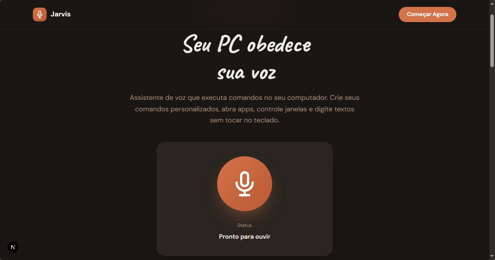

# 🤖 Jarvis — Assistente de Voz com IA 
###### (EM CONSTRUÇÃO)

Controle seu computador usando apenas sua voz! Assistente inteligente com IA que entende comandos naturais e executa ações no seu PC rodando no seu navegador.
> **Stack resumida:** `Python` · `NexyJS` · `Flask` · `Groq (LLaMA 3.3)` · `PyAutoGUI`



## ✨ Características

- 🧠 **IA como cérebro** — Groq (Llama 3.3) decide o que fazer com qualquer comando
- 🎯 **Entende linguagem natural** — Fale como quiser, a IA interpreta
- ⚡ **Execução inteligente** — Abre apps, digita textos, pressiona teclas automaticamente
- 🗣️ **Feedback por voz** — Resposta natural usando síntese de voz
- 🔒 **API Key local** — Sua chave fica no seu PC
- 🌐 **Bilíngue** — Fale em Português ou Inglês

## 🏗️ Arquitetura

```
┌─────────────────────────────────────┐
│  Frontend (Next.js)                 │
│  - Web Speech API (reconhecimento)  │
│  - Speech Synthesis (voz)           │
│  - Interface React                  │
└──────────────┬──────────────────────┘
               │ HTTP (localhost:5000)
               ▼
┌─────────────────────────────────────┐
│  Backend (Python Flask)             │
│  - Envia texto para Groq AI         │
│  - IA interpreta e decide           │
│  - pyautogui executa comandos       │
└─────────────────────────────────────┘

┌─────────────────────────────────────┐
│  Groq Cloud (IA LLaMA 3.3)         │
│  - Compreende linguagem natural     │
│  - Retorna ações pyautogui + fala   │
└─────────────────────────────────────┘
```

## 🚀 Instalação

### Pré-requisitos

- Node.js 18+
- Python 3.8+
- Windows (para pyautogui)
- Groq API Key (configurada em `.env`)

### 1. Instale dependências do Frontend

```bash
npm install
```

### 2. Instale dependências do Backend

```bash
cd backend-python
pip install -r requirements.txt
```

### 3. Configure a API Key

```bash
cd backend-python
copy .env.example .env
```

Abra o arquivo `.env` e cole sua Groq API Key.

> Obtenha uma chave gratuita em [console.groq.com](https://console.groq.com)

## 🎮 Como Usar

> ⚠️ **IMPORTANTE:** São necessários **2 servidores rodando simultaneamente**

### 4. Backend Python (Terminal 1)

```bash
cd backend-python
python main.py
```

✅ Flask vai rodar em `http://localhost:5000`

### 5. Frontend Next.js (Terminal 2)

```bash
npm run dev
```

✅ Frontend vai rodar em `http://localhost:3000`

### 6. Use o Jarvis

1. Abra http://localhost:3000 no navegador
2. Clique no botão do microfone
3. Permita acesso ao microfone
4. **Fale naturalmente** — a IA entende e executa!

## 💡 Exemplos de Comandos

### Abrir apps
- "Abre o Roblox pra mim" → A IA abre o Roblox
- "Abre o navegador" → Abre o Edge
- "Abre o WhatsApp" → Abre o WhatsApp
- "Open Spotify" → Abre o Spotify

### Controlar o PC
- "Nova aba" → Ctrl+T
- "Fecha a aba" → Ctrl+W
- "Minimiza essa janela" → Win+↓
- "Maximiza" → Win+↑
- "Copia isso" → Ctrl+C
- "Cola" → Ctrl+V

### Digitar e teclas
- "Escreva oi tudo bem" → Digita o texto
- "Pressiona Enter" → Enter
- "Pressiona F11" → Tela cheia

### Conversar
- "Oi, tudo bem?" → A IA responde naturalmente
- "Quem é você?" → A IA se apresenta

## 🧠 Como a IA funciona

A IA recebe seu texto, entende a intenção e retorna:
- **tools**: lista de comandos pyautogui para executar
- **speech**: resposta em PT-BR que será lida em voz alta

Exemplo de resposta da IA:
```json
{
  "tools": [{"action": "open_app", "args": ["Edge"]}],
  "speech": "Abrindo o Edge para você."
}
```

## 📁 Estrutura do Projeto

```
jarvis-simple/
├── app/                      # Next.js App Router
│   ├── page.tsx             # Página principal
│   ├── layout.tsx           # Layout global
│   └── globals.css          # Estilos globais
├── components/              # Componentes React
│   └── LandingPage.tsx      # Landing page + assistente
├── backend-python/          # API Python
│   ├── main.py              # Servidor Flask + integração Groq
│   ├── system_prompt.md     # Prompt do sistema da IA
│   ├── .env                 # Groq API Key (sua chave)
│   ├── .env.example         # Modelo para copiar
│   └── requirements.txt     # Dependências Python
├── README.md                # Este arquivo
└── COMANDOS.md              # Exemplos de comandos
```

## 🔧 Tecnologias

### Frontend
- **Next.js 14** — Framework React
- **TypeScript** — Tipagem estática
- **Tailwind CSS** — Estilização
- **Web Speech API** — Reconhec. e síntese de voz

### Backend
- **Flask** — Framework web Python
- **Groq API** — IA para compreensão de linguagem (Llama 3.3)
- **pyautogui** — Automação do sistema

## 🔧 Troubleshooting

### Microfone não funciona
- Use Chrome ou Edge (melhor suporte)
- Permita acesso ao microfone
- Use HTTPS ou localhost

### Comandos não executam
- Verifique se o backend Python está rodando
- Verifique se a `GROQ_API_KEY` está correta no `.env`
- Teste: `curl -X POST http://localhost:5000/execute -H "Content-Type: application/json" -d "{\"text\":\"ola\"}"`

### Erro 401 ou sem resposta da IA
- Verifique se sua API key Groq é válida
- Verifique conexão com internet

## 📄 Licença

MIT License

**Desenvolvido com ❤️ usando Next.js, Python e Groq AI**
